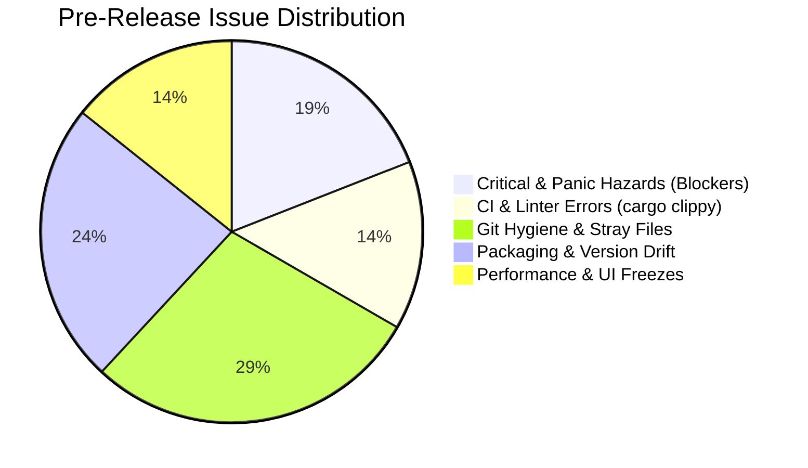
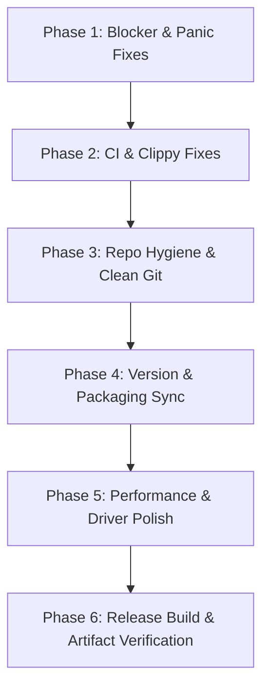

# Tabular Pre-Release Comprehensive Audit & Enhancement Plan (v0.16.2)

> **Status**: Pre-Release Audit Complete  
> **Target Version**: `0.16.2`  
> **Scope**: Code correctness, CI/CD, Git repository hygiene, platform packaging, security, database drivers, and UI performance.

---

## Executive Summary

A comprehensive pre-release check of the entire Tabular client codebase was performed. While core compilation (`cargo check --all-targets`) and unit tests (> 240 tests) pass with 0 failures, several **critical showstoppers, panic hazards, virtual scrolling UI bugs, release metadata drifts, and CI-breaking linter errors** were identified that should be resolved before cutting release `0.16.2`.



---

## 1. Blocker & Panic Hazards (Must Fix Before Release)

### 🔴 1.1 App Crash via `todo!()` in Query AST Rewrite
- **Location**: [`src/query_ast/rewrite.rs:552`](file:///Users/jayuda/Documents/PROJECT/TABULAR/tabular-client/src/query_ast/rewrite.rs#L548-L556)
- **Problem**: When optimizing queries with `UNION`, `INTERSECT`, or `EXCEPT` (`L::SetOp`), the limit pushdown optimizer encounters:
  ```rust
  L::SetOp { left: _left, right: _right, op: _op } => todo!(),
  ```
  This immediately **panics and terminates the app** on release builds whenever a user runs a compound set operation query.
- **Fix**: Handle `L::SetOp` gracefully without panicking (recurse into `left` and `right` or return `changed`).

### 🔴 1.2 Safety Guard Bypass on String Literals
- **Location**: [`src/safety_guard.rs:60`](file:///Users/jayuda/Documents/PROJECT/TABULAR/tabular-client/src/safety_guard.rs#L55-L95)
- **Problem**: `has_top_level_where` does not track SQL single-quoted strings `'...'`. A query like:
  ```sql
  UPDATE users SET bio = 'I live WHERE the sun shines';
  ```
  (which has NO actual `WHERE` clause) is incorrectly parsed as having a `WHERE` clause because the word `WHERE` appears inside the text literal. The user could accidentally mass-modify data without triggering the safety confirmation modal!
- **Fix**: Skip quoted string literals (`'...'` and `"..."`) when scanning for SQL keywords.

### 🔴 1.3 Virtual Scrolling Height & Scrollbar Jump Bug
- **Location**: [`src/data_table/render_data.rs:666-675`](file:///Users/jayuda/Documents/PROJECT/TABULAR/tabular-client/src/data_table/render_data.rs#L660-L730)
- **Problem**: Virtual scrolling calculates `first_row` and `last_row`, adding a top spacer:
  ```rust
  if first_row > 0 { ui.add_space(first_row as f32 * row_height); }
  ```
  However, **it never adds the bottom spacer** for the remaining rows below the viewport:
  ```rust
  // MISSING:
  let remaining_rows = total_rows.saturating_sub(last_row);
  if remaining_rows > 0 { ui.add_space(remaining_rows as f32 * row_height); }
  ```
  **Consequences**: The `ScrollArea` underreports total height to egui. The scrollbar thumb appears huge, jumps wildly as you scroll, and users cannot drag the thumb directly down to browse large tables (e.g. 5,000+ rows).
- **Fix**: Add the bottom spacer after the visible row loop.

### 🔴 1.4 SQLite Table Info Syntax Failure on Quoted/Special Names
- **Location**: [`src/driver_sqlite.rs:29`](file:///Users/jayuda/Documents/PROJECT/TABULAR/tabular-client/src/driver_sqlite.rs#L25-L35)
- **Problem**: `format!("PRAGMA table_info({})", table_name)` fails when table names contain spaces, hyphens, or SQL keywords (e.g. `order`, `user-data`).
- **Fix**: Escape and quote the table identifier properly: `format!("PRAGMA table_info(\"{}\")", table_name.replace('\"', "\"\""))`.

---

## 2. CI/CD & Clippy Errors (Breaks `cargo clippy -- -D warnings`)

GitHub Actions workflow [`.github/workflows/rust.yml`](file:///Users/jayuda/Documents/PROJECT/TABULAR/tabular-client/.github/workflows/rust.yml#L21) runs `cargo clippy -- -D warnings`. Any push or release tag triggers this and will **fail the pipeline**:

1. **`src/editor.rs:5941:40`**:
   ```rust
   // clippy::logic_bug: redundant boolean logic
   if alt_pressed || (cmd_pressed && alt_pressed) { ... }
   ```
   *Fix*: Change to `if alt_pressed { ... }` (consistent with button tooltip `Replace All (Alt+Enter)`).
2. **`src/models/structs.rs:1741:34`**:
   ```rust
   // clippy::approx_constant: 3.14159 matches PI approximation
   let val_num: CellValue = 3.14159.into();
   ```
   *Fix*: Change to `123.45.into()` or `std::f64::consts::PI.into()`.
3. **`src/driver_mysql.rs:83`**:
   Duplicate attempt to read `chrono::NaiveDateTime` by index in `get_value_as_string_fallback_idx`.
   *Fix*: Remove the redundant second check.
4. **`src/backup_restore.rs:319` & `:500`**:
   Collapsible `if` and `b"main\0"` (use `c"main"`).

---

## 3. Repository Hygiene & Accidental Tracked Files

The following files are currently tracked in Git and should be removed from source control:

| File | Size / Type | Issue | Recommended Action |
| :--- | :--- | :--- | :--- |
| `localhost` | 8.0 KB SQLite DB | Binary database created during local testing | `git rm localhost` & add `localhost` to `.gitignore` |
| `pub` | 0 B file | Empty scratch file | `git rm pub` |
| `color.txt` | 2 lines text | Developer color scratchpad | `git rm color.txt` |
| `src/reproduce_issue.rs` | 5.5 KB `.rs` script | Standalone debugging script with duplicate `fn main()` | `git rm src/reproduce_issue.rs` |
| `src/tabular-0.10.0/` | Old deb packaging directory | Lingering inside `src/` | `git rm -r src/tabular-0.10.0/` |
| Root `implementation_plan_*.md` & `walkthrough_*.md` | Multiple docs | Planning files cluttering repo root | Relocate or remove |

### `.gitignore` Improvements:
Add:
```gitignore
localhost
*.db
*.sqlite
*.sqlite3
*.log
```

---

## 4. Packaging, Metadata & Version Synchronization (Target: `0.16.2`)

| Packaging Target | File | Current State | Required Update |
| :--- | :--- | :--- | :--- |
| **Cargo** | [`Cargo.toml`](file:///Users/jayuda/Documents/PROJECT/TABULAR/tabular-client/Cargo.toml#L3) | `0.16.2` | Correct |
| **Xcode (macOS/iOS)** | [`Tabular.xcodeproj/project.pbxproj`](file:///Users/jayuda/Documents/PROJECT/TABULAR/tabular-client/Tabular.xcodeproj/project.pbxproj) | `0.16.2` (build 162) | Correct |
| **Linux AppStream / Flathub** | [`id.tabular.database.metainfo.xml`](file:///Users/jayuda/Documents/PROJECT/TABULAR/tabular-client/id.tabular.database.metainfo.xml#L43) | `0.5.27` (2025-12-17) | Update to `<release version="0.16.2" date="2026-09-11">` with release notes |
| **Flatpak Manifest** | [`flatpak/id.tabular.database.flathub.yml`](file:///Users/jayuda/Documents/PROJECT/TABULAR/tabular-client/flatpak/id.tabular.database.flathub.yml#L60) | `tag: v0.5.27` | Update tag to `v0.16.2` |
| **Arch Linux / AUR** | [`PKGBUILD`](file:///Users/jayuda/Documents/PROJECT/TABULAR/tabular-client/PKGBUILD#L3) & [`aur/tabular-bin/PKGBUILD`](file:///Users/jayuda/Documents/PROJECT/TABULAR/tabular-client/aur/tabular-bin/PKGBUILD#L3) | `0.10.0` | Update `pkgver=0.16.2` |
| **Makefile** | [`Makefile`](file:///Users/jayuda/Documents/PROJECT/TABULAR/tabular-client/Makefile#L55) | `id.tabular.data` | Change to canonical `id.tabular.database` |
| **GitHub Actions** | [`.github/workflows/build.yml`](file:///Users/jayuda/Documents/PROJECT/TABULAR/tabular-client/.github/workflows/build.yml#L30) | `actions/cache@v3`, `action-gh-release@v1` | Update to `@v4` and `@v2` |
| **Security Policy** | [`SECURITY.md`](file:///Users/jayuda/Documents/PROJECT/TABULAR/tabular-client/SECURITY.md#L37-L50) | Generic template placeholder text ("5.1.x, 5.0.x") | Clean up versions and add real security contact email |

---

## 5. Performance & Responsiveness Enhancements

### ⚡ 5.1 N+1 Metadata Querying (Postgres & MySQL)
- **Problem**: When expanding schemas, `driver_postgres.rs` and `driver_mysql.rs` execute queries in nested loops:
  - 1 query per table for columns
  - 1 query per table for indexes
  On a remote database with 100 tables, this creates **200+ round trips sequentially**, freezing loading for 10–30 seconds.
- **Solution**: Query `INFORMATION_SCHEMA.COLUMNS` and `STATISTICS` grouped or filtered by schema in a single batch query, then partition in-memory.

### ⚡ 5.2 UI Thread `block_on` Freezes
- **Problem**: `execute_table_query_sync` in `src/connection/execute.rs` runs `runtime.block_on(async { ... })` directly on the egui thread when filtering, sorting, or paginating data.
- **Solution**: Use non-blocking channel polling (`spawn_query_job`) or display an explicit spinning overlay so the OS does not flag the app as "Not Responding".

### ⚡ 5.3 Startup Console Clutter
- **Problem**: [`src/lib.rs:130`](file:///Users/jayuda/Documents/PROJECT/TABULAR/tabular-client/src/lib.rs#L125-L135) contains `eprintln!("[STARTUP-TIMER ...]")` which prints unconditionally in release binaries.
- **Solution**: Guard with `#[cfg(debug_assertions)]` or `log::debug!`.

### ⚡ 5.4 Dependency Maintenance (`cargo audit`)
- `dotenv 0.15.0` is archived/unmaintained. Replace with `dotenvy 0.15.7`.

---

## Action Plan: Recommended Implementation Order



1. **Phase 1: Panic & Blocker Fixes**
   - Fix `todo!()` in `src/query_ast/rewrite.rs`
   - Fix string quote skipping in `src/safety_guard.rs`
   - Fix bottom spacer in `src/data_table/render_data.rs`
   - Fix table name quoting in `src/driver_sqlite.rs`

2. **Phase 2: CI & Clippy Fixes**
   - Fix boolean logic in `src/editor.rs`
   - Fix approx constant in `src/models/structs.rs`
   - Clean up duplicate line in `src/driver_mysql.rs`
   - Run `cargo clippy -- -D warnings` to guarantee CI green

3. **Phase 3: Repository Hygiene**
   - Remove tracked `localhost`, `pub`, `color.txt`, `src/reproduce_issue.rs`, `src/tabular-0.10.0/`
   - Update `.gitignore`

4. **Phase 4: Packaging & Version Sync to `0.16.2`**
   - Update AppStream `id.tabular.database.metainfo.xml`
   - Update `flatpak/id.tabular.database.flathub.yml`
   - Update `PKGBUILD` and `aur/tabular-bin/PKGBUILD`
   - Update `Makefile` bundle ID
   - Populate `SECURITY.md`

5. **Phase 5: Performance Polish**
   - Optimize N+1 metadata queries
   - Guard startup timer logs
